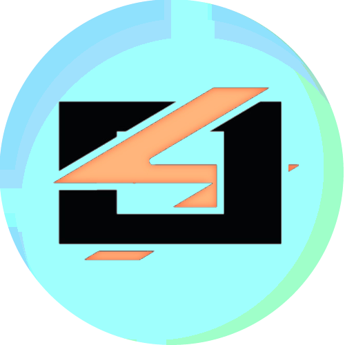

<div align="center">
  
  <h1>BOLT XR | Spatial Finance Terminal</h1>
  <p><strong>BOLT XR</strong> is a professional-grade, immersive multi-chain wallet platform architected for the future of spatial computing (VR/AR/XR).</p>
</div>

## 🚀 Key Features

### 1. Advanced Liquidity & Bridging
- **Expert Aggregation**: Integrated **LI.FI** for cross-chain bridge aggregation and **1inch** for optimal same-chain DEX routing.
- **Native Native Swaps**: Support for decentralized native asset exchanges (e.g., native BTC to native ETH) powered by **Thorchain**.
- **Route Telemetry**: Real-time spatial tracking of transaction routes, estimated bridging times, and liquidity sources directly in the XR terminal.

### 2. Expert Multi-Chain Architecture
- **Native Non-EVM Support**: Full integration for **Bitcoin (BIP84 SegWit)**, **Sui (Ed25519)**, and **Tron (Base58Check)**.
- **Stateless Logic Engine**: A hardened, stateless core substrate that eliminates race conditions during concurrent multi-chain operations.
- **BIP39/BIP44 Standard**: Industrial-strength mnemonic management with standardized derivation paths.

### 3. Immersive Spatial UI/UX
- **Depth-Aware Terminal**: Floating glassmorphic interfaces built with `RoundedBox` geometry for a tactile physical presence.
- **Interactive Swap Scale**: A procedural 3D balancing scale with real-time physics and route visualization.
- **Dynamic Telemetry**: Chain-specific transaction data including Bitcoin fee density (sats/vB) and Sui gas estimation.

### 4. Hardened Security
- **Immersive PIN Pad**: Fully sandboxed, in-scene authentication system with anti-brute force lockouts.
- **Local Vault Substrate**: AES-GCM encrypted local storage vault. Private keys never leave the spatial environment.

## 🛠️ Technology Stack
- **Frontend**: Next.js 16 (App Router)
- **3D Logic**: Three.js / React Three Fiber / @react-three/drei
- **Spatial**: @react-three/xr v6
- **Liquidity**: LI.FI, 1inch, Thorchain
- **Cryptography**: ethers.js, bitcoinjs-lib, @mysten/sui, xchainjs, bip39

## 📦 Installation & Setup

### Requirements
- Node.js 20+
- WebXR compatible browser or headset (Meta Quest 3, Apple Vision Pro, etc.)

### Quick Start
```bash
# Install dependencies (EVM + Non-EVM + Bridges)
npm install

# Start the spatial development server
npm run dev
```

### Electron Distribution
```bash
# Build for desktop release
npm run electron:build
```

---
Built with ❤️ by the **BOLT XR** Team.
