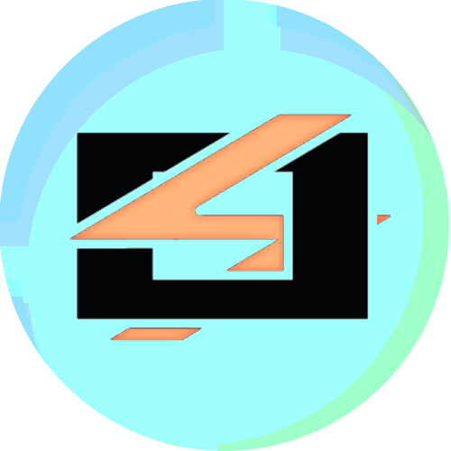

<div align="center">
  
  <h1>BOLT XR | Spatial Finance Terminal</h1>
  <p><strong>BOLT XR</strong> is a professional-grade, immersive multi-chain wallet platform architected for the future of spatial computing (VR/AR/XR).</p>
</div>

## 🚀 Key Features

### 1. Expert Multi-Chain Architecture
- **Native Non-EVM Support**: Native integration for **Bitcoin (BIP84 SegWit)**, **Sui (Ed25519)**, and **Tron (Base58Check)**.
- **Stateless Logic Engine**: A hardened, stateless core substrate that eliminates race conditions during concurrent multi-chain operations.
- **BIP39/BIP44 Standard**: Industrial-strength mnemonic management with standardized derivation paths for cross-wallet compatibility.

### 2. Immersive Spatial UI/UX
- **Depth-Aware Terminal**: Floating glassmorphic interfaces built with `RoundedBox` geometry for a tactile, physical presence in 3D space.
- **Dynamic Telemetry**: Chain-specific transaction data including Bitcoin fee density (sats/vB), Sui gas estimation, and EVM gas prices.
- **Procedural 3D Assets**: Real-time rendered metallic tokens and an interactive **Swap Scale** for physics-based asset exchanges.

### 3. Hardened Security
- **Immersive PIN Pad**: A fully sandboxed, in-scene authentication system with anti-brute force lockouts and haptic feedback.
- **Local Vault Substrate**: AES-GCM encrypted local storage vault. Private keys never leave the spatial environment.
- **Secure Info Panel**: Mnemonic phrases are displayed via a gaze-activated 3D panel to prevent shoulder surfing and browser-level sniffing.

### 4. High-Performance Connectivity
- **Hybrid RPC Engine**: Intelligent provider caching and fallback mechanisms using standard JSON-RPC and REST aggregators (Blockstream, Sui Fullnodes).
- **Sub-Second Valuations**: Real-time asset pricing via Pyth Hermes API.

## 🛠️ Technology Stack
- **Frontend**: Next.js 16 (App Router)
- **3D Logic**: Three.js / React Three Fiber / @react-three/drei
- **Spatial**: @react-three/xr v6
- **Cryptography**: ethers.js, bitcoinjs-lib, @mysten/sui, bip39
- **Styling**: Tailwind CSS 4

## 📦 Installation & Setup

### Requirements
- Node.js 20+
- WebXR compatible browser or headset (Meta Quest 3, Apple Vision Pro, etc.)

### Quick Start
```bash
# Install dependencies (including non-EVM libraries)
pnpm install

# Start the development server (http://localhost:3000)
pnpm dev
```

`dev` and `build` first copy the MediaPipe hand-tracking model and runtime from
`node_modules` into `public/vendor/` (see `scripts/copy-vendor-assets.mjs`), so hand
tracking is served by the app itself — no CDN at runtime, and it works offline.

### Desktop XR Emulation
For local desktop testing without a headset, enable Meta IWER through a local-only environment file:

```bash
NEXT_PUBLIC_ENABLE_XR_EMULATION=true
```

Keep this in `.env.local`; `.env*` files are ignored so the flag is not distributed. The app installs the emulated Meta Quest 3 WebXR runtime only when native `navigator.xr` is unavailable. To explicitly override native WebXR during debugging, add:

```bash
NEXT_PUBLIC_FORCE_XR_EMULATION=true
```

Do not enable either flag for production, Electron release builds, or headset validation builds.

### Desktop App (Electron)
```bash
# Develop: Next dev server + Electron window
pnpm electron:dev

# Preview the production export in Electron without packaging
pnpm electron:preview

# Build installers (Windows portable, macOS dmg, Linux AppImage) into dist/
pnpm electron:build
```

The desktop app serves the static export from a private `app://bolt` origin (so assets,
WebCrypto and camera access work), runs sandboxed with context isolation, opens external
links in your default browser, and only grants camera and clipboard permissions.

## 📜 Security & Distribution
- **Audit Status**: Experimental. Use for spatial development and demonstration.
- **Asset Optimization**: All 3D assets are optimized for high-performance WebGL rendering (90fps+).

---
Built with ❤️ by the **BOLT XR** Team.
